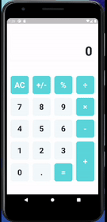

# Level Up #2 - Calculadora

Segundo desafio proposto pela Raro Academy.

## Getting Started

Level Up são desafios propostos pela Raro Academy para consolidar o conhecimento passado durante as aulas semanais da academia. Para o Level Up #2, foi solicitado que fizéssemos uma calculadora, algo que foi trabalhado durante durante algumas aulas da segunda semana da Raro Academy.

## To Do
- [ ] Adicionar a funcionalidade do botão "+/-"
- [ ] Adicionar a funcionalidade do botão "%"
- [ ] Correção de Bugs
    - [ ] A calculadora não está reconhecendo operações com três ou mais valores

## Referência

- O layout teve como inspiração o template criado por [Yuliana Buitrago](https://dribbble.com/yulianaglez) disponível no [Dribbble](https://dribbble.com/shots/7152776-Calculator).
